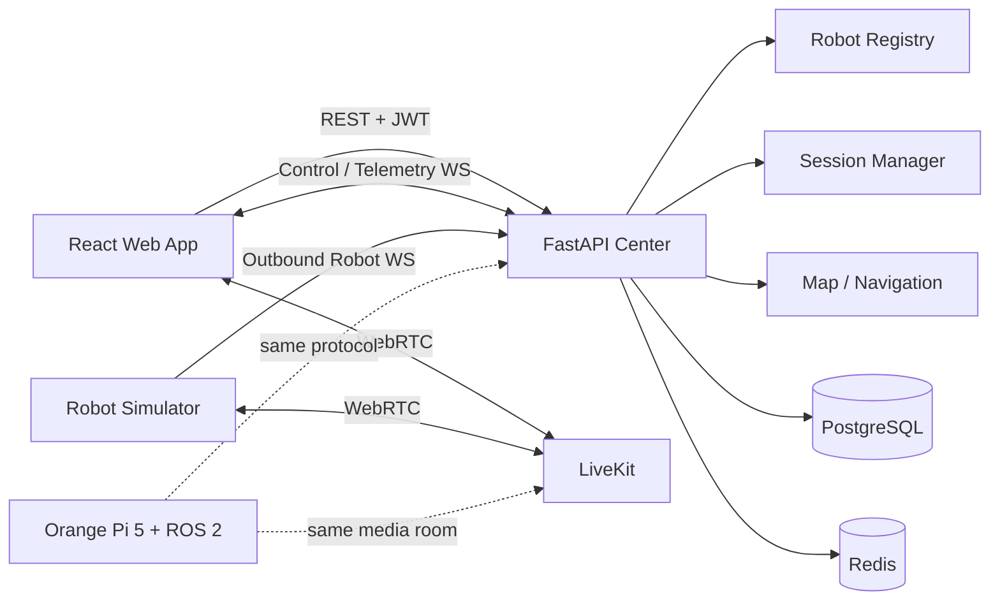
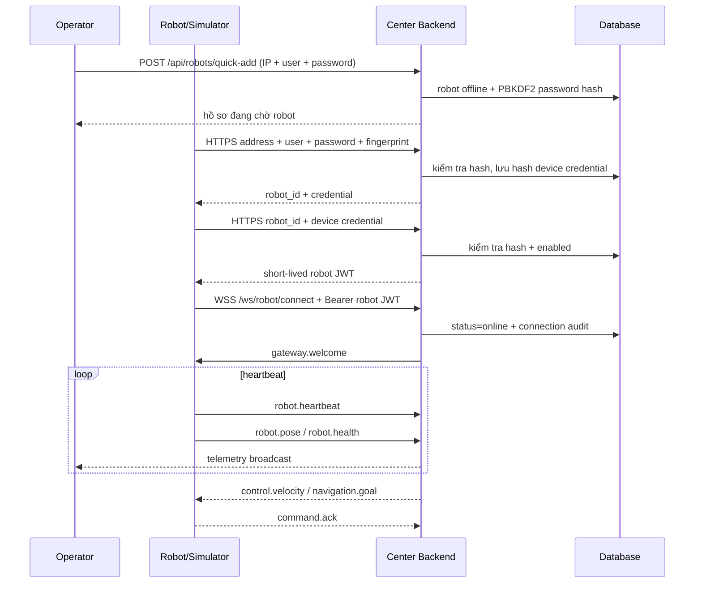
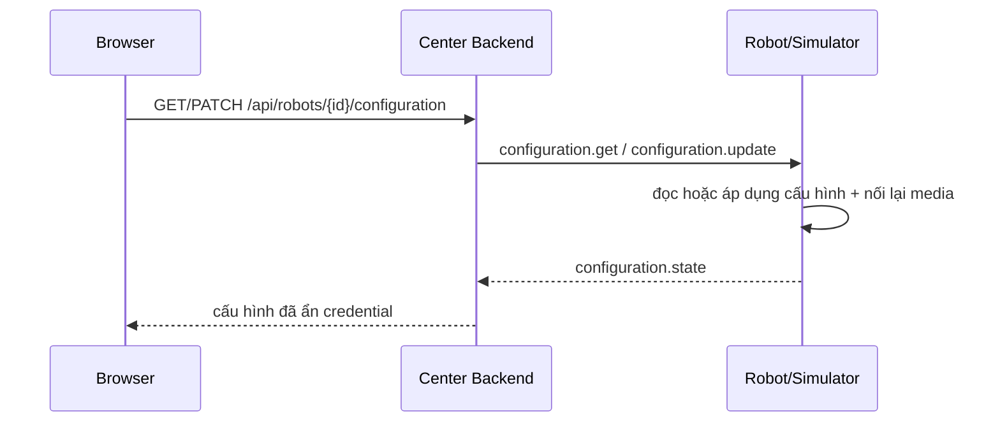
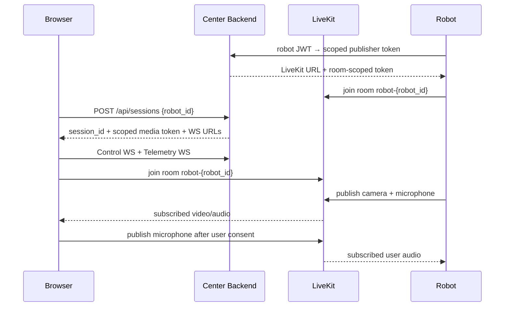
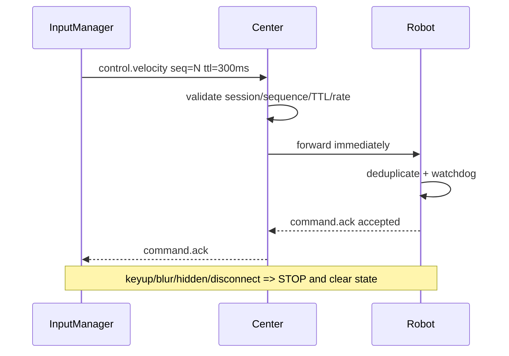
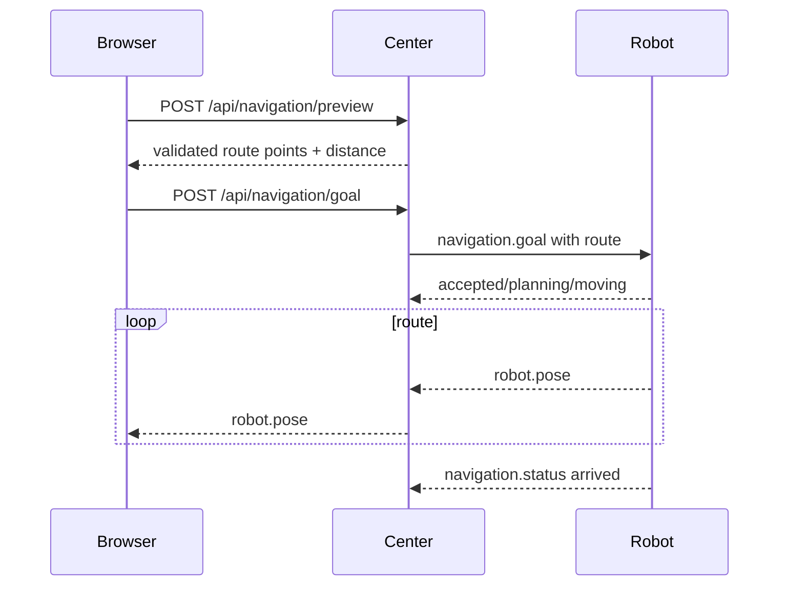

# Kiến trúc Robot Telepresence

## Mục tiêu

Hệ thống giữ cùng một ranh giới tích hợp cho robot mô phỏng và robot thật. Trình
duyệt chỉ biết `robot_id`; mọi lệnh đều đi qua Session Manager và Command
Router. Robot luôn chủ động mở kết nối outbound đến Center Backend.

## Ranh giới module

- `src/apps/center-frontend`: User Web Application.
- `src/apps/center-backend`: registry, session, command/telemetry gateway, maps,
  navigation và token media.
- `src/packages/contracts`: JSON Schema và TypeScript types độc lập transport.
- `src/packages/map-utils`: phép đổi tọa độ world/pixel/Leaflet.
- `demo/robot-simulator`: process độc lập; không được import vào center.
- `src/infrastructure`: Docker Compose và cấu hình dịch vụ.

`ConnectionHub` trong bản demo là adapter presence/session realtime in-memory.
Các repository SQLAlchemy và cấu hình Redis đã được tách để thay adapter mà
không đổi API hoặc simulator protocol.

## Luồng robot kết nối

## Luồng cấu hình robot

Center chỉ chuyển tiếp yêu cầu và chờ phản hồi có `request_id`; cấu hình thuộc
robot/simulator. Robot ngoại tuyến trả HTTP 409, còn yêu cầu quá hạn trả HTTP
504.

## Luồng người dùng và WebRTC

## Luồng teleoperation

## Luồng navigation

## State machines

| Domain | States |
| --- | --- |
| Robot connection | `idle → selecting → connecting → connected → reconnecting → disconnecting`; terminal/exception: `offline`, `error` |
| Media | `idle → requesting_token → connecting → connected`; exception: `reconnecting`, `no_video`, `no_audio`, `permission_denied`, `failed` |
| Control | `disabled → ready → active → stopping`; exception: `expired`, `session_lost`, `robot_offline` |
| Navigation | `idle → previewing → route_ready → sending_goal → moving → arrived`; exception: `cancelled`, `failed` |

## Lộ trình triển khai

1. Infrastructure, persistence schema, backend skeleton.
2. Robot Registry, gateway, heartbeat/presence.
3. Session lock, command/telemetry WebSocket, simulator motion.
4. LiveKit token/media adapters.
5. Safe input manager và teleoperation UI.
6. Map, destination, preview và navigation simulator.
7. Tests, recovery, observability và ROS 2 integration.
