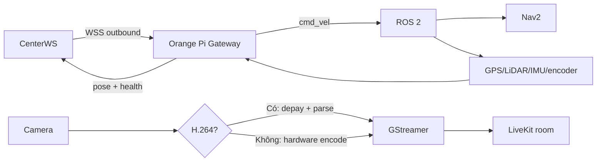

# Thay simulator bằng Orange Pi 5 + ROS 2

Không thay frontend. Robot thật triển khai đúng ba adapter:

1. `RobotConnectionClient`: outbound WSS gateway, credential riêng, heartbeat,
   reconnect có jitter, protocol JSON v1.0.
2. `CommandReceiver`: validate `message_id`, `sequence`, timestamp và TTL; map
   `linear_x/angular_z` sang `geometry_msgs/Twist`; STOP đặt zero velocity ngay.
3. `TelemetryPublisher`: chuyển pose/Nav2/health sang `robot.pose`,
   `robot.health`, `navigation.status`.

## Kết nối và xác thực

Orange Pi không mở HTTP/RTSP port cho Center truy cập trực tiếp. Edge agent chủ
động kết nối outbound nên hoạt động được sau NAT:

1. Operator nhập IP/hostname, tài khoản và mật khẩu cục bộ của robot; Center
   tạo hồ sơ offline và chỉ lưu PBKDF2 hash.
2. Khi chạy, edge agent gửi ba thông tin đó + device fingerprint qua HTTPS tới
   `/api/robot-auth/claim`, nhận `robot_id` và credential ngẫu nhiên rồi lưu
   trong device state quyền `0600`.
3. Gửi `robot_id` + device credential qua `/api/robot-auth/token`, nhận JWT
   `type=robot` sống 15 phút và mở WSS gateway bằng Bearer header.
4. Dùng JWT gọi `/api/robot-auth/media-token?purpose=main` cho audio/subscription
   và `purpose=video` cho tiến trình camera. Hai token cùng bị giới hạn ở phòng
   `robot-{robot_id}` nhưng có identity riêng, nên kết nối camera không đá kết
   nối gateway/audio ra khỏi LiveKit.
5. Camera USB/CSI/RTSP được capture tại Orange Pi rồi publish WebRTC; browser
   không kết nối thẳng tới IP của Orange Pi. Nguồn H.264 chỉ depay/parse rồi
   publish, không decode và encode lại.

Chỉ device credential nằm trên Orange Pi, nên lưu bằng file quyền `0600`, TPM
hoặc secure element nếu có. `JWT_SECRET` và `LIVEKIT_API_SECRET` chỉ nằm ở
Center. Mật khẩu quản trị cục bộ nằm trong file env quyền `0600`; Center lưu
PBKDF2 hash, còn device credential được lưu dạng SHA-256. Sửa/xoá, revoke/rotate
và trạng thái online được quản lý qua device registry. Khi production nên bổ
sung rate limit và audit bảo mật tập trung.

Ví dụ environment của edge agent:

```env
CENTER_API_URL=https://center.example.com
CENTER_ROBOT_WS_URL=wss://center.example.com/ws/robot/connect
ROBOT_MANAGEMENT_ADDRESS=192.168.1.20
ROBOT_USERNAME=operator
ROBOT_PASSWORD=<local-management-password>
ROBOT_STATE_FILE=~/.config/rovera/device.json
```

Camera, microphone và loa không cần cấu hình trong environment. Khi robot
online, Center đọc danh sách thiết bị từ edge, cho operator chọn nguồn và lưu
lựa chọn vào device state quyền `0600`. Luồng microphone của browser được robot
subscribe và phát ra loa đã chọn; microphone robot vẫn publish về browser.

Mở outbound TCP 443 tới Center/reverse proxy, TCP 7881 và UDP
`51000-51020` tới LiveKit (hoặc TURN 3478/443 theo cấu hình). Không cần mở
inbound port trên Orange Pi.

Repo có sẵn
[`edge.env.example`](../demo/robot-simulator/edge.env.example) và unit systemd
[`rovera-robot.service`](../demo/robot-simulator/deploy/rovera-robot.service).
Đặt repo ở `/opt/rovera`, file secret ở `/etc/rovera/robot.env` với quyền
`0600`, tạo `/var/lib/rovera` cho user dịch vụ, thêm user vào group
`docker`/`video`/`audio`, rồi enable unit để edge agent tự khởi động và
reconnect sau reboot. Unit mặc định chạy image container cố định; Python,
FFmpeg và pip trên host không được sử dụng. Device state đã claim sẽ được tái
sử dụng; không phải cập nhật Center theo từng lần khởi động.

USB/analog audio đi trực tiếp qua `/dev/snd` và group `audio`. Với loa hoặc
headset Bluetooth do PipeWire/PulseAudio quản lý, service phải thấy socket của
đúng user âm thanh: đặt `PULSE_UID=<uid>` hoặc
`PULSE_SOCKET_DIR=/run/user/<uid>/pulse` trong `/etc/rovera/robot.env`. Sau khi
robot online, xác nhận bằng **Cấu hình → Âm thanh → Quét → Phát âm kiểm tra
loa** trước khi mở phiên đàm thoại. Trang vận hành phải chạy trong secure
context HTTPS (ngoại lệ `localhost`) để trình duyệt cho phép publish micro.

Dockerfile tự nhận kiến trúc khi build. Trên Orange Pi 5/ARM64 image build
Rockchip MPP và FFmpeg có `h264_rkmpp`; trên x86_64 image cài VA-API. Runtime
chỉ chọn một backend sau khi encode thử thành công, vì vậy lệnh triển khai vẫn
chỉ là:

```bash
cd demo/robot-simulator
sudo docker compose up -d --build
```

Nếu camera xuất H.264, cả hai backend trên đều được bỏ qua. Nếu camera xuất
MJPEG/raw, thứ tự `VIDEO_ENCODER=auto` là RKMPP, VA-API, NVENC, V4L2M2M rồi
phần mềm. Các node `/dev/dri`, `/dev/dma_heap`, `/dev/mpp_service`, `/dev/rga`
và tên tương đương trên kernel Rockchip được đưa vào container.

Khi chạy thủ công, đặt `.env` cạnh `run.sh` và dùng state trong home như ví dụ.
Chỉ đổi thành `/var/lib/rovera/device.json` khi chạy bằng unit systemd.

Bridge gợi ý:



## Safety

- ROS node phải có watchdog độc lập 300–500 ms; không dựa riêng vào browser.
- STOP và e-stop luôn ưu tiên hơn navigation.
- Không replay queue sau reconnect.
- Credential được tạo ngẫu nhiên khi claim/enroll, lưu riêng trên từng robot
  và có thể rotate khi robot offline.
- Giới hạn vận tốc phía robot, dù command từ Center đã được clamp.
- Production dùng TLS/WSS, TURN và certificate pinning nếu môi trường yêu cầu.

`navigation.goal.payload.points` có thể được thay bằng goal Nav2 hoặc route do
Nav2 trả về; phiên bản protocol mới phải được negotiation thay vì thêm nhánh
`if simulator` ở frontend.
